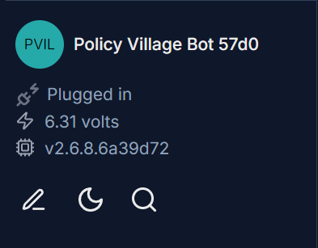
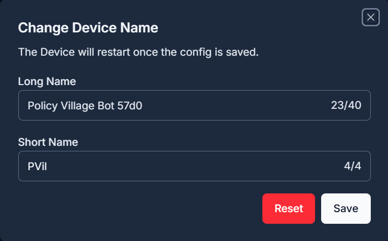
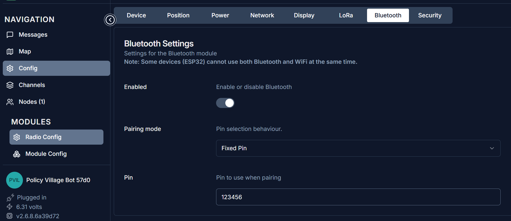
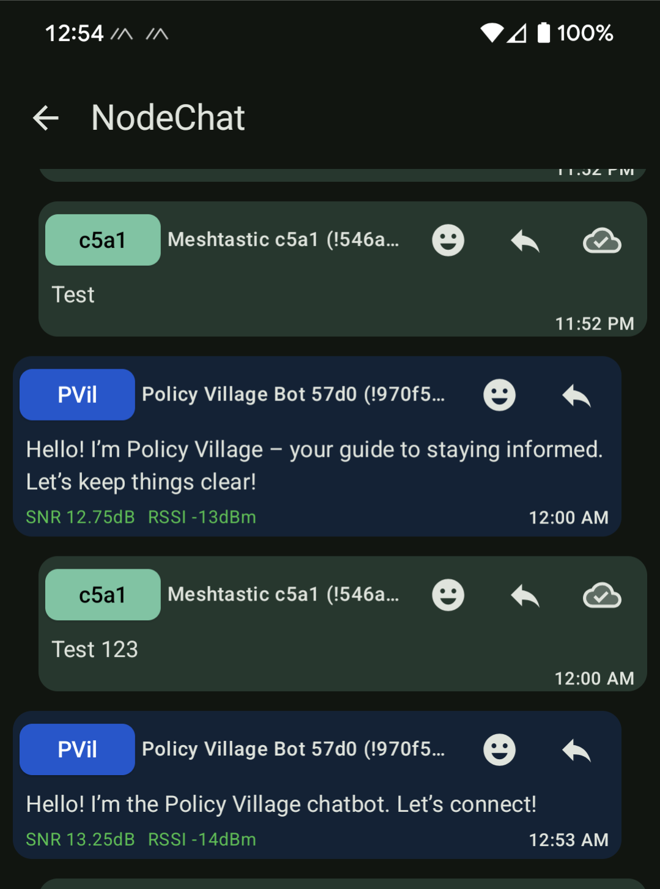
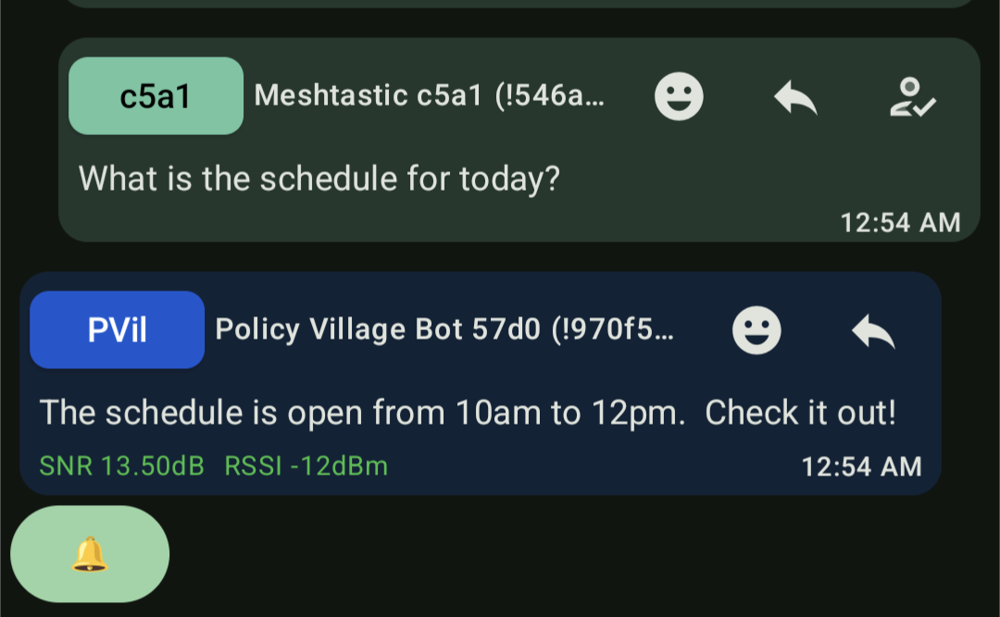

# VillageBot

VillageBot is a Meshtastic based chatbot designed to run on a Raspberry Pi. It's meant to provide a simple framework for the villages participating in DEFCON33 to interact with attendees via Meshtastic devices. It uses Ollama to run a local LLM model, so other than the initial setup and model download, you shouldn't need an internet connection when running.  You can customize what model is being used and how the bot responds to meesages by editing [context.yaml](./context.yaml).  

## Requirements

- A Meshtastic compatible radio
    - [Meshtastic Device List](https://meshtastic.org/docs/hardware/devices/)
- Raspberry Pi or other computer capable of running [Ollama](https://ollama.com/) locally

## Setup

### Meshtastic

First, using a computer, flash your Meshtastic radio with the latest version of the defcon firmware found [here](https://defcon.meshtastic.org/#).  After you've flashed your radio, connect to it over the [web client](https://client.meshtastic.org/) to finish configuring it.  

Within the web client, we want to do two things, rename the radio and change the Bluetooth pin.  

| Renaming the Radio |
| :---: |
|  |
| To rename the radio, click on the pencil icon at the bottom left of the web client. |
|  |
| Within the popup menu you can now rename your radio to something that will be both easier to recognize and more obviously affiliated with your village / workshop /demo.  Note the small name can only be up to four characters, so get creative.  |

After renaming your radio, we need to change the Bluetooth settings to make it more resistant to driveby attacks.  Most meshtasitc radios all use a default bluetooth pin of 123456.  This makes them easy to take over if they lose bluetooth connection to their original device.  At the same time, if you're connecting over serial, like we are for this chatbot, the Bluetooth radio will still listen for and let an attacker connect and transmit over the device.  To solve this we need to either change the Bluetooth pin to something other than the default, or disable the Bluetooth connection entirely.  

| :---: |
|  |
| Within the web client, select Config -> Radio Config -> Bluetooth to get to this screen.  If you plan on only talking to the Meshtastic radio over a Serial interface, go ahead and disable the Bluetooth entirely.  Otherwise change the pin to something other than the default. |

### Software

You will need the python packages for PyYAML, Meshtastic, and Ollama.  Additionally, within Ollama you will want to go ahead and download the local LLM model you want to use.  

## Running the Chatbot

To run the code all you need to do is run [bot.py](./bot.py).  Depending on your setup, you may want to make it a service that runs at startup to protect from reboots.  

The code currently supports the chatbot broadcasting a connection message on a channel of the users choosing and automatically listening and responding to direct messages from other Meshtastic radios.  Currently we don't support responding to broadcast messages so as to reduce the risk of spam.  

| Examples messages |
| :---: |
|  |
| Above is an example of the broadcast messages the chatbot will transmit on startup.  These are generated by the LLM, so they're someone random each time. |
|  |
| Above is an example of the chatbot responding to messages from a user. |
